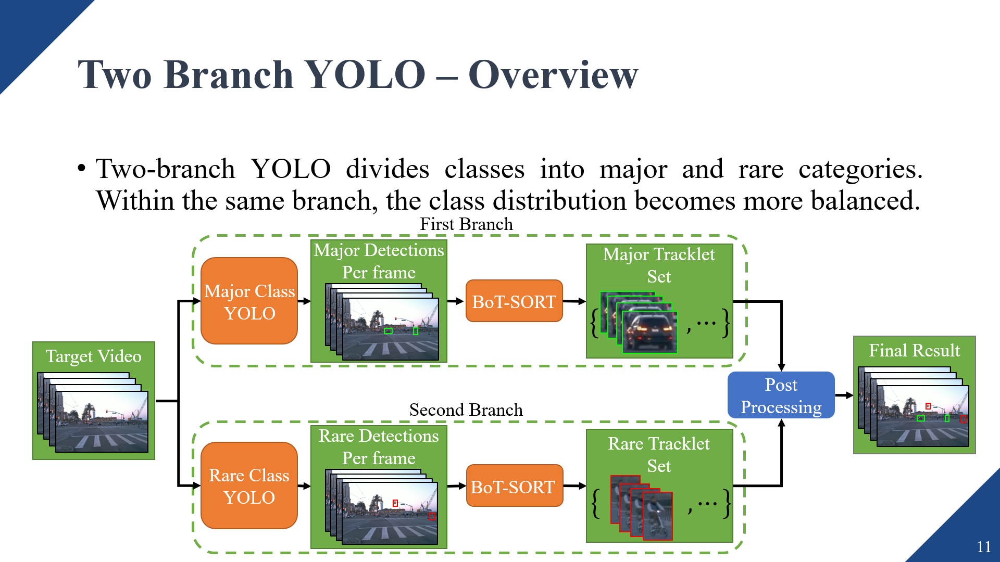
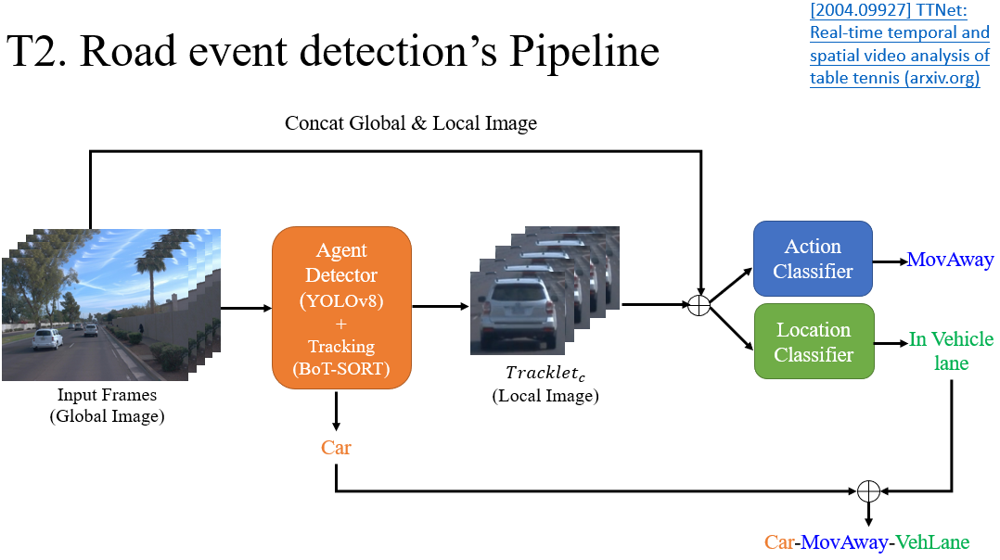

# ROADpp_challenge_ICCV2023

### [ICCV2023 Workshop: The ROAD++ Challenge Track1 Winner (1st)](https://sites.google.com/view/road-plus-plus/challenge?authuser=0#h.zbmjfm1sbx03)

## File Tree
```
├── demo_pic_and_video
├── ROAD_Waymo_Baseline
├── Road-waymo-dataset
├── runs (Save model's weight)
│   ├── action
│   ├── detect
│   └── location
├── Track1
├── Track2
├── utils
```
## Track1 Full Pipeline

## Track2 Full Pipeline


## Environment Setup
```
conda create --name ROADpp python>=3.10
conda activate ROADpp
pip install -r requirement.txt
```

## Quick Start
You need to first understand how to configure the YAML file for [YOLOv8](https://docs.ultralytics.com/), as well as the dataset format.

### Example for Two branch Track1
```
cd ROADpp_challenge_ICCV2023
python detect.py --video_path 'xxx' --yolo_path 'xxx' --two_branch True --major_path 'xxx' rare_path 'xxx' --pkl_name 'xxx' --save_res 'xxx'
```

## Config
- `mode`: Detect mode, only accepts Track1 or Track2.

- `video_path`: Path to the video.

- `yolo_path`: Path to the YOLO model.

- `two_branch`: Indicates whether to use two-branch YOLO.

- `major_path`: Path to the major YOLO model.

- `rare_path`: Path to the rare YOLO model.

- `devices`: GPU number.

- `imgsz`: YOLO input size.

- `video_shape`: Original video resolution.

- `submit_shape`: Final submit shape.

- `pkl_name`: Submit file name (*.pkl).

- `save_res`: Save submit file.

- `action_detector_path`: Path to the action detector model (Track2 only).

- `loc_detector_path`: Path to the location detector model (Track2 only).

- `t2_input_shape`: Track 2 input shape.

- `windows_size`: Sliding windows shape.


## ToDo

- [x] Convert Datasets to YOLO format()
- [x] Train YOLOv8 on Track1(train_YOLOv8.py)
- [x] implement Tracklet Function
- [x] Track2 Pipeline
- [x] Two branch Yolo Pipeline
- [x] Implement linear interpolation bbox function
- [ ] Complete quick start guide(config using YMAL file)
- [ ] Fix T2 interpolation bug
- [ ] Two branch T2