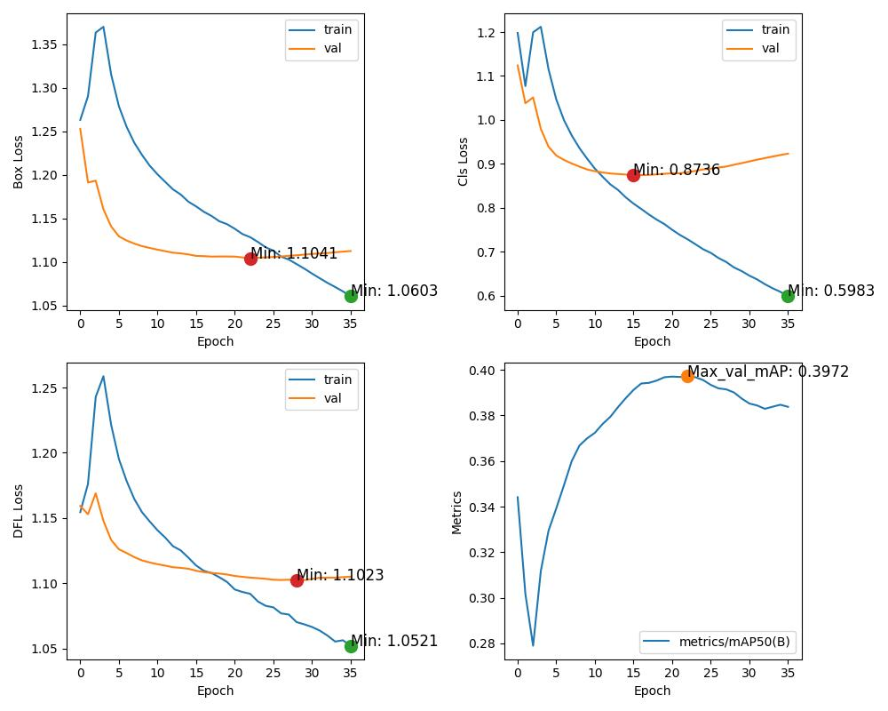

# ROADpp_challenge_ICCV2023

## T1_YOLOv8_640*640_demo

## Training Curve

### T1_YOLOv8_1920*1280

### T1_YOLOv8_1280*1280_Mosaic

## ToDo

- [x] Convert Datasets to YOLO format()
- [x] Train YOLOv8 on Track1(train_YOLOv8.py)
- [ ] Train YOLOv8 on Track2
- [ ] Implement linear interpolation bbox function 