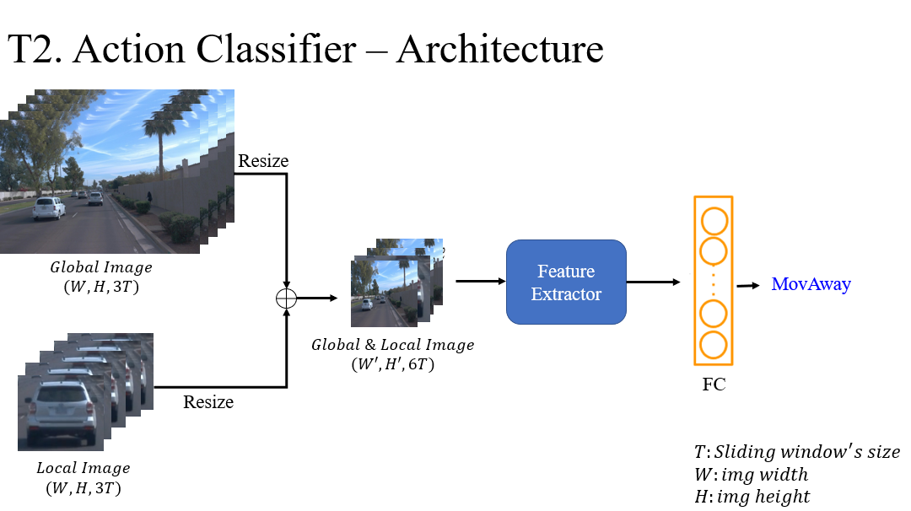
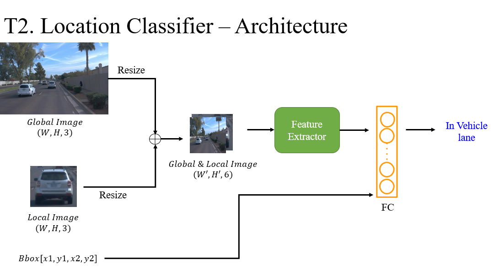

# Track2




## Track2 Dataset File Tree
```
@126
/datasets/roadpp/Track2/
├── train_00000 (video_ID)
│   ├── global
│   │   ├── 00001.jpg (Frame_ID)
│   │   ├── 00002.jpg
│   │   ├── 00003.jpg
│   │   ├── ...
│   └── local
│       ├── 0_Ped (Agent_ID)
│       │   ├── 0611ea50-f652-406d-942a-9ec7e3e90546 (Tube_uID # Track ID)
│       │   │   ├── 00001.jpg
│       │   │   ├── 00002.jpg
│       │   │   ├── ...
│       │   │   ├── label.csv
│       │   ├── 08b1e19e-b912-4963-a7bb-55e138bbc25e
│       │   ├── ...
│       ├── 1_Car
│       │   ├── 12ba81ee-9cee-4134-94ca-df9ed01e0ff1
│       │   ├── 1fa40b66-1897-4d0b-93e9-a9445372962b
│       │   ├── ...
├── train_00001
...
```

## label.csv Format
frame_id  |       x1 |       y1|       x2 |       y2 |agent_id|action_id|loc_id | tube_id|
--------- | -------- | --------| ---------| ---------|--------|---------|-------| -------|
00001     |0.5310... |0.3584...|0.6241... | 0.4803...|5       |8        |15     |2ab9f...|